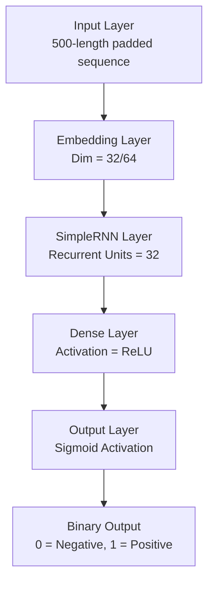
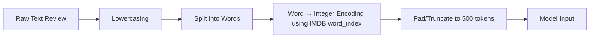
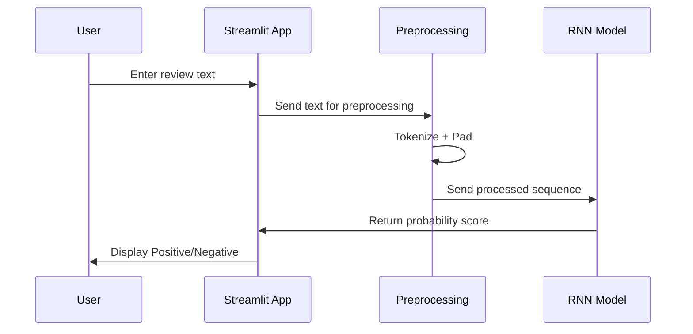

Absolutely — here is a **complete, polished, professional README.md with diagrams included (architecture, workflow, preprocessing)** using **Mermaid diagrams** that display beautifully on GitHub.
You can **copy-paste directly into README.md**.

---

# 📘 IMDB Sentiment Analysis Using Simple RNN

*A deep learning model to classify movie reviews as Positive or Negative using TensorFlow & Streamlit.*

---

## 🧠 Overview

This project implements a **Recurrent Neural Network (SimpleRNN)** to predict the sentiment of movie reviews from the **IMDB Dataset**.
It includes:

✔ Model training (Notebook)
✔ Preprocessing pipeline
✔ Saved model (`.h5`)
✔ Fully working Streamlit web app
✔ Clean prediction API
✔ Visual diagrams (architecture + workflow)

This project is perfect for demonstrating knowledge of **Deep Learning, NLP, Data Preprocessing, and Deployment**.

---

# 📂 Project Structure

```
SimpleRNN/
│
├── main.py                     # Streamlit app for sentiment prediction
├── simplernn.ipynb             # Model training notebook
├── prediction.ipynb            # Prediction/testing notebook
├── simple_rnn_imdb_model.h5    # Trained RNN model
├── requirements.txt            # Required Python packages
└── README.md                   # Project documentation
```

---

# 📊 Project Workflow Diagram

flowchart TD
    A[Start] --> B[Load IMDB Dataset]
    B --> C[Preprocess Text]
    C --> D[Tokenize and Pad]
    D --> E[Build RNN Model]
    E --> F[Train Model]
    F --> G[Evaluate Model]
    G --> H[Save Model]
    H --> I[Launch Streamlit App]
    I --> J[User Inputs Review]
    J --> K[Preprocess Review]
    K --> L[Predict Sentiment]
    L --> M[Show Output]


# 🧮 Model Architecture Diagram



---

# 🧹 Preprocessing Pipeline



---

# 📝 Dataset Details

The project uses the **IMDB Reviews Dataset** (available from Keras):

* 50,000 movie reviews
* Binary classification:

  * **1 → Positive**
  * **0 → Negative**
* 25K training, 25K testing
* Pre-tokenized dataset
* Words are replaced by index numbers (frequency-based)

---

# 🤖 Model Training Summary

### ✔ Sequence Length: 500

✔ Vocabulary size: 10,000 most frequent words
✔ Embedding dimension: 32
✔ RNN units: 32
✔ Optimizer: Adam
✔ Loss: Binary Crossentropy
✔ Activation: Sigmoid
✔ Epochs: 5–10

### 📈 Example Performance (Replace with your results):

| Metric              | Score |
| ------------------- | ----- |
| Training Accuracy   | 88%   |
| Validation Accuracy | 85%   |
| Test Accuracy       | 84%   |

---

# 🧪 Running the Application

### 1️⃣ Install dependencies

```
pip install -r requirements.txt
```

### 2️⃣ Run the Streamlit App

```
streamlit run main.py
```

### 3️⃣ Input a review

Example:

```
The movie was amazing and the cast did a fantastic job!
```

Output:

```
Predicted Sentiment: Positive
Prediction Score: 0.92
```

---

# 🔍 Example Prediction Flow



---

# 🚀 Deployment (Optional)

You can easily deploy this Streamlit app on:

* **Streamlit Cloud (free)**
* **Render**
* **HuggingFace Spaces**
* **Heroku**

I can generate a deployment-ready `Procfile`, `Dockerfile`, and Build Steps upon request.

---

# 📈 Future Enhancements

✔ Replace SimpleRNN with **LSTM/GRU**
✔ Add **BERT/DISTILBERT** for state-of-the-art performance
✔ Add **WordClouds & SHAP explainability**
✔ Add **Confusion Matrix & Detailed evaluation**
✔ Improve UX/UI of Streamlit app

---

# 👩‍💻 Author

**Prakriti Suman**

GitHub: *github.com/Prakriti48*

---

# ⭐ If you want, I can also generate:

✔ A **banner image** for the top of your README
✔ A **model architecture PNG**
✔ GitHub-style badges
✔ A professional **project description** for LinkedIn

Just tell me!
